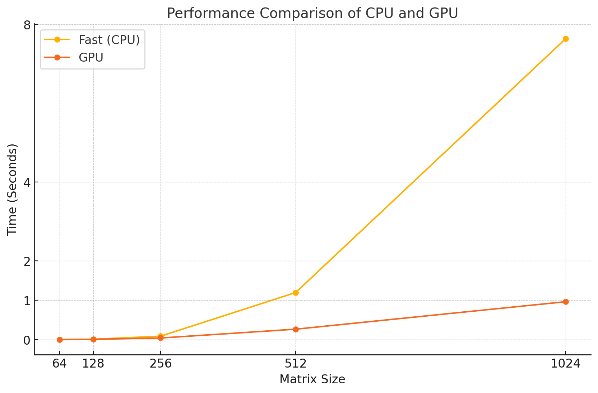

# MiniTorch Module 3


* Docs: https://minitorch.github.io/

* Overview: https://minitorch.github.io/module3.html


You will need to modify `tensor_functions.py` slightly in this assignment.

* Tests:

```
python run_tests.py
```

* Note:

Several of the tests for this assignment will only run if you are on a GPU machine and will not
run on github's test infrastructure. Please follow the instructions to setup up a colab machine
to run these tests.

This assignment requires the following files from the previous assignments. You can get these by running

```bash
python sync_previous_module.py previous-module-dir current-module-dir
```

The files that will be synced are:

        minitorch/tensor_data.py minitorch/tensor_functions.py minitorch/tensor_ops.py minitorch/operators.py minitorch/scalar.py minitorch/scalar_functions.py minitorch/module.py minitorch/autodiff.py minitorch/module.py project/run_manual.py project/run_scalar.py project/run_tensor.py minitorch/operators.py minitorch/module.py minitorch/autodiff.py minitorch/tensor.py minitorch/datasets.py minitorch/testing.py minitorch/optim.py

# 3.4


Timing output:
```
Timing summary
Size: 64
    fast: 0.00294
    gpu: 0.00559
Size: 128
    fast: 0.01394
    gpu: 0.01277
Size: 256
    fast: 0.09210
    gpu: 0.04554
Size: 512
    fast: 1.19863
    gpu: 0.26912
Size: 1024
    fast: 7.63548
    gpu: 0.96579
```
# 3.5

## Simple
```
/bin/bash: line 1: cd: mod3-chloewang-200: No such file or directory
reducing sismpleOps
reducing sismpleOps
Epoch 0 | loss 7.482784608388794 | correct 28 | epoch time 1.3371180295944214 seconds | total time 13.371183156967163 seconds
Epoch 10 | loss 1.858914488430353 | correct 48 | epoch time 0.009911751747131348 seconds | total time 17.515466451644897 seconds
Epoch 20 | loss 4.131223893722531 | correct 46 | epoch time 0.009837818145751954 seconds | total time 18.530884981155396 seconds
Epoch 30 | loss 1.8459913361646907 | correct 48 | epoch time 0.020205354690551756 seconds | total time 20.25266456604004 seconds
Epoch 40 | loss 0.5534859654532824 | correct 50 | epoch time 0.010148978233337403 seconds | total time 21.80689764022827 seconds
Epoch 50 | loss 0.4232065693482836 | correct 48 | epoch time 0.010309290885925294 seconds | total time 22.853278160095215 seconds
Epoch 60 | loss 0.5050188995205305 | correct 50 | epoch time 0.010016679763793945 seconds | total time 23.881259441375732 seconds
Epoch 70 | loss 0.8134331153132112 | correct 49 | epoch time 0.00987551212310791 seconds | total time 24.898353338241577 seconds
Epoch 80 | loss 0.8416180701872226 | correct 49 | epoch time 0.009883403778076172 seconds | total time 25.90907621383667 seconds
Epoch 90 | loss 0.36375658561779545 | correct 50 | epoch time 0.009862613677978516 seconds | total time 26.92969298362732 seconds
Epoch 100 | loss 0.05721094252355905 | correct 49 | epoch time 0.009850025177001953 seconds | total time 27.987830877304077 seconds
Epoch 110 | loss 1.837817032649581 | correct 49 | epoch time 0.009863853454589844 seconds | total time 29.004815340042114 seconds
Epoch 120 | loss 1.496790577636419 | correct 49 | epoch time 0.009960293769836426 seconds | total time 30.024624586105347 seconds
Epoch 130 | loss 0.3530964902340121 | correct 49 | epoch time 0.009882903099060059 seconds | total time 31.04829692840576 seconds
Epoch 140 | loss 1.2007296887953596 | correct 49 | epoch time 0.015004348754882813 seconds | total time 32.78579568862915 seconds
Epoch 150 | loss 0.6755353831226263 | correct 49 | epoch time 0.010295629501342773 seconds | total time 34.24966859817505 seconds
Epoch 160 | loss 0.8506590613275266 | correct 50 | epoch time 0.010177874565124511 seconds | total time 35.28252077102661 seconds
Epoch 170 | loss 1.3043735377459964 | correct 48 | epoch time 0.01005089282989502 seconds | total time 36.30877757072449 seconds
Epoch 180 | loss 0.05808238872986384 | correct 49 | epoch time 0.010027885437011719 seconds | total time 37.3416850566864 seconds
Epoch 190 | loss 0.0024627867639305675 | correct 49 | epoch time 0.01036694049835205 seconds | total time 38.36895203590393 seconds
Epoch 200 | loss 0.5317138362878134 | correct 49 | epoch time 0.009953117370605469 seconds | total time 39.406349897384644 seconds
Epoch 210 | loss 0.16567414298220084 | correct 49 | epoch time 0.010278725624084472 seconds | total time 40.45257019996643 seconds
Epoch 220 | loss 1.1309029856949948 | correct 50 | epoch time 0.009944391250610352 seconds | total time 41.487754106521606 seconds
Epoch 230 | loss 0.5930423153375077 | correct 50 | epoch time 0.009949398040771485 seconds | total time 42.51346778869629 seconds
Epoch 240 | loss 0.03468624171179067 | correct 48 | epoch time 0.010173869132995606 seconds | total time 43.542794942855835 seconds
Epoch 250 | loss 0.17096329648992317 | correct 49 | epoch time 0.019891810417175294 seconds | total time 45.09063482284546 seconds
Epoch 260 | loss 1.742187739179521 | correct 48 | epoch time 0.017809200286865234 seconds | total time 46.83814549446106 seconds
Epoch 270 | loss 0.08256185074119307 | correct 50 | epoch time 0.011529016494750976 seconds | total time 47.87453842163086 seconds
Epoch 280 | loss 0.19253978278052403 | correct 50 | epoch time 0.010048794746398925 seconds | total time 48.91096210479736 seconds
Epoch 290 | loss 0.030117049285346795 | correct 49 | epoch time 0.009878897666931152 seconds | total time 49.944029808044434 seconds
Epoch 300 | loss 0.07718753051849896 | correct 49 | epoch time 0.009774875640869141 seconds | total time 50.95888638496399 seconds
Epoch 310 | loss 0.06713873635268855 | correct 50 | epoch time 0.009972643852233887 seconds | total time 51.971033573150635 seconds
Epoch 320 | loss 0.6387790221168231 | correct 49 | epoch time 0.00992894172668457 seconds | total time 52.99063324928284 seconds
Epoch 330 | loss 0.569777704724665 | correct 49 | epoch time 0.009937405586242676 seconds | total time 54.00442671775818 seconds
Epoch 340 | loss 0.856178550760658 | correct 49 | epoch time 0.009900307655334473 seconds | total time 55.02832889556885 seconds
Epoch 350 | loss 1.72741574841579 | correct 49 | epoch time 0.017618870735168456 seconds | total time 56.183499813079834 seconds
Epoch 360 | loss 0.0036653185751569905 | correct 50 | epoch time 0.02428290843963623 seconds | total time 58.49111366271973 seconds
Epoch 370 | loss 0.12927847912187868 | correct 49 | epoch time 0.021312379837036134 seconds | total time 60.577316761016846 seconds
Epoch 380 | loss 0.2570354848185662 | correct 49 | epoch time 0.009895014762878417 seconds | total time 61.58541560173035 seconds
Epoch 390 | loss 0.020086015147702807 | correct 50 | epoch time 0.00986630916595459 seconds | total time 62.588483572006226 seconds
Epoch 400 | loss 0.056922352426431344 | correct 49 | epoch time 0.010502243041992187 seconds | total time 63.59981179237366 seconds
Epoch 410 | loss 1.151051357919849 | correct 50 | epoch time 0.00970442295074463 seconds | total time 64.60713982582092 seconds
Epoch 420 | loss 0.3203224042989827 | correct 50 | epoch time 0.009614968299865722 seconds | total time 65.60731148719788 seconds
Epoch 430 | loss 0.5121365321920067 | correct 50 | epoch time 0.009685063362121582 seconds | total time 66.65514588356018 seconds
Epoch 440 | loss 0.062092632497497455 | correct 48 | epoch time 0.009842944145202637 seconds | total time 67.68774318695068 seconds
Epoch 450 | loss 1.199714586795603 | correct 50 | epoch time 0.00994546413421631 seconds | total time 68.70754766464233 seconds
Epoch 460 | loss 0.47688761444408817 | correct 50 | epoch time 0.009847879409790039 seconds | total time 69.73349118232727 seconds
Epoch 470 | loss 0.5997729301089313 | correct 49 | epoch time 0.01539018154144287 seconds | total time 70.88765358924866 seconds
Epoch 480 | loss 0.5974753806388999 | correct 50 | epoch time 0.023929786682128907 seconds | total time 72.8332691192627 seconds
Epoch 490 | loss 0.10272071580271623 | correct 48 | epoch time 0.009665942192077637 seconds | total time 73.96312808990479 seconds
```

## Split
```
Epoch 0 | loss 7.831631287615768 | correct 25 | epoch time 1.4014841556549071 seconds | total time 14.014845132827759 seconds
Epoch 10 | loss 6.331656467430193 | correct 33 | epoch time 0.01857752799987793 seconds | total time 19.562109231948853 seconds
Epoch 20 | loss 5.836103843498983 | correct 42 | epoch time 0.01122279167175293 seconds | total time 21.155996084213257 seconds
Epoch 30 | loss 4.511348326394109 | correct 42 | epoch time 0.010791778564453125 seconds | total time 22.316871881484985 seconds
Epoch 40 | loss 4.626374105476812 | correct 49 | epoch time 0.010386800765991211 seconds | total time 23.485459327697754 seconds
Epoch 50 | loss 3.7959745887969323 | correct 47 | epoch time 0.011453795433044433 seconds | total time 24.647359132766724 seconds
Epoch 60 | loss 2.9736297668906944 | correct 46 | epoch time 0.011255812644958497 seconds | total time 25.80965828895569 seconds
Epoch 70 | loss 2.119715057483354 | correct 49 | epoch time 0.01071155071258545 seconds | total time 26.999252796173096 seconds
Epoch 80 | loss 1.9977777980763811 | correct 50 | epoch time 0.010859870910644531 seconds | total time 28.16040015220642 seconds
Epoch 90 | loss 2.1341191593462505 | correct 50 | epoch time 0.012037372589111328 seconds | total time 29.303908109664917 seconds
Epoch 100 | loss 1.372473777921672 | correct 50 | epoch time 0.01520085334777832 seconds | total time 30.44624400138855 seconds
Epoch 110 | loss 1.5507558943165431 | correct 50 | epoch time 0.018752670288085936 seconds | total time 32.49675941467285 seconds
Epoch 120 | loss 1.9886535279898288 | correct 49 | epoch time 0.011443614959716797 seconds | total time 33.90903830528259 seconds
Epoch 130 | loss 1.2301019839389107 | correct 49 | epoch time 0.011053180694580078 seconds | total time 35.028000354766846 seconds
Epoch 140 | loss 1.0544237162874028 | correct 50 | epoch time 0.01118481159210205 seconds | total time 36.14410066604614 seconds
Epoch 150 | loss 0.5409095069943676 | correct 50 | epoch time 0.010874748229980469 seconds | total time 37.26969504356384 seconds
Epoch 160 | loss 1.3789254068314458 | correct 50 | epoch time 0.01186995506286621 seconds | total time 38.4067280292511 seconds
Epoch 170 | loss 0.9928808112341839 | correct 50 | epoch time 0.011711740493774414 seconds | total time 39.55281400680542 seconds
Epoch 180 | loss 0.6268216355940703 | correct 50 | epoch time 0.011388039588928223 seconds | total time 40.72709846496582 seconds
Epoch 190 | loss 2.427175985683802 | correct 47 | epoch time 0.011876678466796875 seconds | total time 41.91195845603943 seconds
Epoch 200 | loss 0.9513275302070037 | correct 50 | epoch time 0.015637016296386717 seconds | total time 43.12919592857361 seconds
Epoch 210 | loss 0.3902973620704325 | correct 50 | epoch time 0.020055413246154785 seconds | total time 45.095534563064575 seconds
Epoch 220 | loss 1.5306669754566344 | correct 49 | epoch time 0.012261033058166504 seconds | total time 46.45080590248108 seconds
Epoch 230 | loss 0.6548132494496508 | correct 49 | epoch time 0.01013648509979248 seconds | total time 47.49501705169678 seconds
Epoch 240 | loss 0.4250043286916931 | correct 50 | epoch time 0.010606861114501953 seconds | total time 48.582016944885254 seconds
Epoch 250 | loss 0.39924350060621916 | correct 50 | epoch time 0.011664485931396485 seconds | total time 49.68336749076843 seconds
Epoch 260 | loss 0.38526839072655844 | correct 50 | epoch time 0.018028974533081055 seconds | total time 50.81936693191528 seconds
Epoch 270 | loss 0.3868332801395844 | correct 50 | epoch time 0.010013341903686523 seconds | total time 51.85708403587341 seconds
Epoch 280 | loss 0.5328426105368245 | correct 50 | epoch time 0.009861183166503907 seconds | total time 52.87931156158447 seconds
Epoch 290 | loss 0.13599767987823663 | correct 50 | epoch time 0.009901165962219238 seconds | total time 53.89848494529724 seconds
Epoch 300 | loss 0.25613113282349304 | correct 49 | epoch time 0.009918999671936036 seconds | total time 54.92450785636902 seconds
Epoch 310 | loss 0.5525007809037956 | correct 49 | epoch time 0.02214393615722656 seconds | total time 56.33384108543396 seconds
Epoch 320 | loss 0.19723147619522016 | correct 49 | epoch time 0.009983539581298828 seconds | total time 58.123751640319824 seconds
Epoch 330 | loss 0.45255416849747193 | correct 50 | epoch time 0.009941530227661134 seconds | total time 59.1430606842041 seconds
Epoch 340 | loss 0.32450077405859273 | correct 50 | epoch time 0.009902453422546387 seconds | total time 60.163713455200195 seconds
Epoch 350 | loss 0.14674765347673618 | correct 49 | epoch time 0.01008012294769287 seconds | total time 61.183600425720215 seconds
Epoch 360 | loss 0.05131752774600447 | correct 50 | epoch time 0.009948444366455079 seconds | total time 62.21255016326904 seconds
Epoch 370 | loss 0.08507609458810128 | correct 50 | epoch time 0.009878134727478028 seconds | total time 63.236757040023804 seconds
Epoch 380 | loss 1.3610202111377012 | correct 49 | epoch time 0.010204935073852539 seconds | total time 64.27353310585022 seconds
Epoch 390 | loss 0.1322990632792364 | correct 50 | epoch time 0.009998393058776856 seconds | total time 65.31933403015137 seconds
Epoch 400 | loss 0.2036188215786712 | correct 50 | epoch time 0.009926342964172363 seconds | total time 66.34910798072815 seconds
Epoch 410 | loss 0.2645085046716825 | correct 50 | epoch time 0.01022789478302002 seconds | total time 67.4048433303833 seconds
Epoch 420 | loss 0.004898851216400721 | correct 48 | epoch time 0.01815774440765381 seconds | total time 68.89086389541626 seconds
Epoch 430 | loss 0.19402778924711186 | correct 50 | epoch time 0.011282110214233398 seconds | total time 70.64637517929077 seconds
Epoch 440 | loss 0.4409239876693602 | correct 50 | epoch time 0.010970544815063477 seconds | total time 71.6803126335144 seconds
Epoch 450 | loss 0.4454006593182312 | correct 50 | epoch time 0.011437296867370605 seconds | total time 72.71606588363647 seconds
Epoch 460 | loss 0.12259563545025888 | correct 50 | epoch time 0.011353135108947754 seconds | total time 73.75513339042664 seconds
Epoch 470 | loss 0.05801406370289203 | correct 50 | epoch time 0.010622978210449219 seconds | total time 74.78496551513672 seconds
Epoch 480 | loss 0.029829978850945377 | correct 50 | epoch time 0.010393190383911132 seconds | total time 75.83492040634155 seconds
Epoch 490 | loss 0.33766427505378205 | correct 50 | epoch time 0.009968304634094238 seconds | total time 76.86209344863892 seconds
```

## XOR
```
Epoch 0 | loss 7.35122721074165 | correct 21 | epoch time 1.3577061891555786 seconds | total time 13.577064514160156 seconds
Epoch 10 | loss 3.832978653553087 | correct 35 | epoch time 0.009891438484191894 seconds | total time 17.764360189437866 seconds
Epoch 20 | loss 3.755171552122908 | correct 45 | epoch time 0.00989997386932373 seconds | total time 18.77659320831299 seconds
Epoch 30 | loss 4.722726462060841 | correct 47 | epoch time 0.009989714622497559 seconds | total time 19.79268455505371 seconds
Epoch 40 | loss 3.6740143530521316 | correct 46 | epoch time 0.015909695625305177 seconds | total time 20.986931562423706 seconds
Epoch 50 | loss 4.766078269183837 | correct 42 | epoch time 0.02156839370727539 seconds | total time 22.878788709640503 seconds
Epoch 60 | loss 2.9302524999218718 | correct 45 | epoch time 0.009876394271850586 seconds | total time 24.014626026153564 seconds
Epoch 70 | loss 4.830815048182981 | correct 43 | epoch time 0.010231328010559083 seconds | total time 25.043734550476074 seconds
Epoch 80 | loss 5.126122283145902 | correct 47 | epoch time 0.010021591186523437 seconds | total time 26.07122254371643 seconds
Epoch 90 | loss 4.355221543543837 | correct 47 | epoch time 0.009907865524291992 seconds | total time 27.104007720947266 seconds
Epoch 100 | loss 1.9075010520274323 | correct 45 | epoch time 0.00988306999206543 seconds | total time 28.11383366584778 seconds
Epoch 110 | loss 1.8346823401561745 | correct 49 | epoch time 0.009953761100769043 seconds | total time 29.139616012573242 seconds
Epoch 120 | loss 3.823615987822455 | correct 47 | epoch time 0.00995330810546875 seconds | total time 30.15899348258972 seconds
Epoch 130 | loss 2.009401245885269 | correct 48 | epoch time 0.00987856388092041 seconds | total time 31.173019886016846 seconds
Epoch 140 | loss 1.0195047900575889 | correct 49 | epoch time 0.010027003288269044 seconds | total time 32.20896553993225 seconds
Epoch 150 | loss 1.6840740758804713 | correct 48 | epoch time 0.017964649200439452 seconds | total time 33.34028744697571 seconds
Epoch 160 | loss 1.4366413771752693 | correct 47 | epoch time 0.024922728538513184 seconds | total time 35.44128227233887 seconds
Epoch 170 | loss 1.2908482416028844 | correct 49 | epoch time 0.010099840164184571 seconds | total time 36.530487298965454 seconds
Epoch 180 | loss 1.1747265198553591 | correct 48 | epoch time 0.010225987434387207 seconds | total time 37.564112424850464 seconds
Epoch 190 | loss 0.5894108554357342 | correct 49 | epoch time 0.01009538173675537 seconds | total time 38.60229969024658 seconds
Epoch 200 | loss 1.4625985636521104 | correct 48 | epoch time 0.010104918479919433 seconds | total time 39.64290928840637 seconds
Epoch 210 | loss 0.7753020530617488 | correct 48 | epoch time 0.010145163536071778 seconds | total time 40.68553614616394 seconds
Epoch 220 | loss 1.2438987469544456 | correct 47 | epoch time 0.009931826591491699 seconds | total time 41.71144938468933 seconds
Epoch 230 | loss 3.6211291722985015 | correct 45 | epoch time 0.009975457191467285 seconds | total time 42.74636101722717 seconds
Epoch 240 | loss 1.1051676783099695 | correct 49 | epoch time 0.010300779342651367 seconds | total time 43.78040170669556 seconds
Epoch 250 | loss 0.8338068563035628 | correct 48 | epoch time 0.011668562889099121 seconds | total time 44.834049224853516 seconds
Epoch 260 | loss 2.834090840471439 | correct 46 | epoch time 0.03373188972473144 seconds | total time 46.38437104225159 seconds
Epoch 270 | loss 1.0475151622834222 | correct 48 | epoch time 0.009873080253601074 seconds | total time 48.132041931152344 seconds
Epoch 280 | loss 0.7225408801988031 | correct 49 | epoch time 0.010002636909484863 seconds | total time 49.14523911476135 seconds
Epoch 290 | loss 0.5343493010168217 | correct 48 | epoch time 0.011438107490539551 seconds | total time 50.190112829208374 seconds
Epoch 300 | loss 1.0474012821369534 | correct 48 | epoch time 0.009742999076843261 seconds | total time 51.22119927406311 seconds
Epoch 310 | loss 0.5174446724020219 | correct 49 | epoch time 0.009594058990478516 seconds | total time 52.22562098503113 seconds
Epoch 320 | loss 1.1338333632713213 | correct 49 | epoch time 0.009680366516113282 seconds | total time 53.2376811504364 seconds
Epoch 330 | loss 0.48773789740541085 | correct 49 | epoch time 0.010249829292297364 seconds | total time 54.27965211868286 seconds
Epoch 340 | loss 1.4720078544078097 | correct 50 | epoch time 0.009903645515441895 seconds | total time 55.290828466415405 seconds
Epoch 350 | loss 0.3294733890253027 | correct 49 | epoch time 0.010008287429809571 seconds | total time 56.328635692596436 seconds
Epoch 360 | loss 0.928057505695876 | correct 48 | epoch time 0.00987091064453125 seconds | total time 57.348419427871704 seconds
Epoch 370 | loss 0.6350083182493269 | correct 49 | epoch time 0.0226001501083374 seconds | total time 58.727035999298096 seconds
Epoch 380 | loss 0.8316020228848414 | correct 49 | epoch time 0.023540782928466796 seconds | total time 60.54689073562622 seconds
Epoch 390 | loss 0.7310153643012827 | correct 48 | epoch time 0.010229396820068359 seconds | total time 61.5877103805542 seconds
Epoch 400 | loss 0.22702173075425458 | correct 49 | epoch time 0.00997307300567627 seconds | total time 62.60379505157471 seconds
Epoch 410 | loss 1.29189826457475 | correct 48 | epoch time 0.009831500053405762 seconds | total time 63.621018171310425 seconds
Epoch 420 | loss 0.12966046364606945 | correct 50 | epoch time 0.00987699031829834 seconds | total time 64.63354158401489 seconds
Epoch 430 | loss 0.496555281995472 | correct 49 | epoch time 0.009802031517028808 seconds | total time 65.65730690956116 seconds
Epoch 440 | loss 0.3795312273956023 | correct 50 | epoch time 0.009918117523193359 seconds | total time 66.71210765838623 seconds
Epoch 450 | loss 0.3881743075967091 | correct 49 | epoch time 0.009788870811462402 seconds | total time 67.72389149665833 seconds
Epoch 460 | loss 0.29574841745748615 | correct 50 | epoch time 0.009806585311889649 seconds | total time 68.73925232887268 seconds
Epoch 470 | loss 2.1818725917084563 | correct 49 | epoch time 0.010212254524230958 seconds | total time 69.76352858543396 seconds
Epoch 480 | loss 0.28008715490165914 | correct 48 | epoch time 0.017542719841003418 seconds | total time 70.94412994384766 seconds
Epoch 490 | loss 1.2497276824186339 | correct 50 | epoch time 0.023357462882995606 seconds | total time 72.88469314575195 seconds
```
